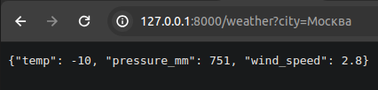
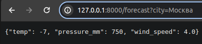
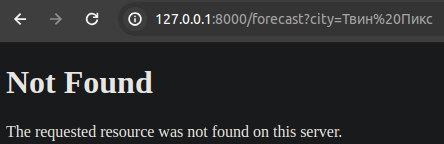
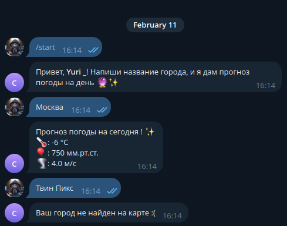

# Инструкция по запуску

### Установка зависимостей через poetry
Директория /city_weather
- **Установка зависимостей:** poetry install

### Запуск Django проекта
Директория /city_weather/web_server
- **Запускаем среду poetry:** poetry shell
- **Миграция:**  python3 manage.py migrate
- **Загрузка фикстуры:** python3 manage.py loaddata cities
- **Запуск проекта под daphne:** 
daphne web_server.asgi:application

### Запуск Telegram бота
Директория /city_weather/telegram_bot
- **Запускаем среду poetry:** poetry shell
- **Запуск:** python3 main.py

# Описание хода выполнения тестового задания

Согласно тестовому заданию нужно реализовать два сервиса:
- джанго веб сервер
- телеграм бот

Веб сервер должен предоставлять api по ТЕКУЩЕЙ погоде.
Телеграм бот должен предоставлять ПРОГНОЗ погоды на день.
Логично реализовать api на Django для получения и текущих погодных данных, и прогноза. 
Остальные же сервисы, как наш телеграм бот, смогут использовать это api. 

Кэширование в редис реализовал в middleware

Данные по городам положил в фикстуру

Валидацию данных от yandex сделал на pydantic, эту же модель использует и телеграм бот

# Пример работы программной системы

## Веб сервер

### Текущие данные

### Прогноз

### Прогноз для несуществующего города

## Телеграм бот

